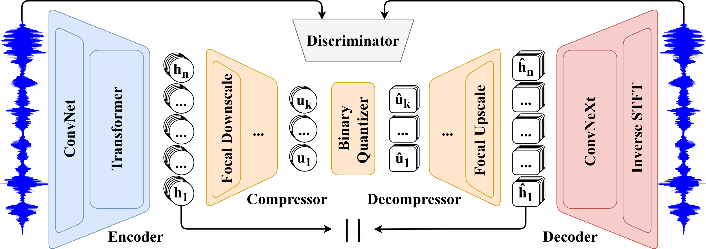

# ⚡ FocalCodec [](https://colab.research.google.com/github/lucadellalib/focalcodec/blob/main/demo.ipynb)


A low-bitrate single-codebook 16 / 24 kHz speech codec based on [focal modulation](https://arxiv.org/abs/2203.11926).

- 📜 **Preprints**:

    - [FocalCodec: Low-Bitrate Speech Coding via Focal Modulation Networks](https://arxiv.org/abs/2502.04465)

    - [FocalCodec-Stream: Streaming Low-Bitrate Speech Coding via Causal Distillation](https://arxiv.org/abs/2509.16195)

- 🌐 **Project Page**: https://lucadellalib.github.io/focalcodec-web/

- 🔊 **Downstream Tasks**: https://github.com/lucadellalib/audiocodecs



---------------------------------------------------------------------------------------------------------

## 📢 News

- **[2025-09-19]** – 📜 Released preprint: [FocalCodec-Stream: Streaming Low-Bitrate Speech Coding via Causal Distillation](https://arxiv.org/abs/2509.16195)
- **[2025-09-18]** – 🎉 FocalCodec has been accepted at **NeurIPS 2025**!
- **[2025-02-06]** – 📜 Released preprint: [FocalCodec: Low-Bitrate Speech Coding via Focal Modulation Networks](https://arxiv.org/abs/2502.04465)

---------------------------------------------------------------------------------------------------------

## 📰 Changelog

### v0.0.2 (2025-09-21)

- Added support for **streaming inference**
- Released **causal checkpoints for real-time inference**
- Added experimental support for **ONNX export and inference**
- Improved inference speed via **precomputed relative positional embeddings**
- Improved overall **code structure and documentation**

### v0.0.1 (2025-02-12)

- Initial release (available at https://github.com/lucadellalib/focalcodec/tree/v0.0.1)

---------------------------------------------------------------------------------------------------------

## 📌 Available Checkpoints

|                                                Checkpoint                                                 | Sample Rate (kHz, In / Out) | Token Rate (Hz) | Codebooks | Bitrate (kbps) | Streaming | Latency (ms) |   Dataset    |
|:---------------------------------------------------------------------------------------------------------:|:---------------------------:|:---------------:|:---------:|:--------------:|:---------:|:------------:|:------------:|
|            [lucadellalib/focalcodec_50hz](https://huggingface.co/lucadellalib/focalcodec_50hz)            |           16 / 16           |      50.0       |  1x8192   |      0.65      |     ❌     |      —       | LibriTTS-960 |
| [lucadellalib/focalcodec_50hz_65k_causal](https://huggingface.co/lucadellalib/focalcodec_50hz_65k_causal) |           16 / 24           |      50.0       |  1x65536  |      0.80      |     ✅     |      80      | Libri-Light  |
|  [lucadellalib/focalcodec_50hz_4k_causal](https://huggingface.co/lucadellalib/focalcodec_50hz_4k_causal)  |           16 / 24           |      50.0       |  1x4096   |      0.60      |     ✅     |      80      | Libri-Light  |
|  [lucadellalib/focalcodec_50hz_2k_causal](https://huggingface.co/lucadellalib/focalcodec_50hz_2k_causal)  |           16 / 24           |      50.0       |  1x2048   |      0.55      |     ✅     |      80      | Libri-Light  |
|            [lucadellalib/focalcodec_25hz](https://huggingface.co/lucadellalib/focalcodec_25hz)            |           16 / 16           |      25.0       |  1x8192   |      0.33      |     ❌     |      —       | LibriTTS-960 |
|          [lucadellalib/focalcodec_12_5hz](https://huggingface.co/lucadellalib/focalcodec_12_5hz)          |           16 / 16           |      12.5       |  1x8192   |      0.16      |     ❌     |      —       | LibriTTS-960 |

---------------------------------------------------------------------------------------------------------

## 🛠️️ Installation

First of all, install [Python 3.8 or later](https://www.python.org). Then, open a terminal and run:

```
pip install huggingface-hub safetensors sounddevice soundfile torch torchaudio
```

---------------------------------------------------------------------------------------------------------

## ▶️ Quickstart

**NOTE**: the `audios` directory contains audio samples that you can download and use to test the codec.

You can easily load the model using `torch.hub` without cloning the repository:

```python
import torch
import torchaudio

# Load FocalCodec model
codec = torch.hub.load(
    repo_or_dir="lucadellalib/focalcodec",
    model="focalcodec",
    config="lucadellalib/focalcodec_50hz",
    force_reload=True,  # Fetch the latest FocalCodec version from Torch Hub
)
codec.eval().requires_grad_(False)

# Load and preprocess the input audio
audio_file = "audios/librispeech-dev-clean/251-118436-0003.wav"
sig, sample_rate = torchaudio.load(audio_file)
sig = torchaudio.functional.resample(sig, sample_rate, codec.sample_rate_input)

# Encode audio into tokens
toks = codec.sig_to_toks(sig)  # Shape: (batch, time)
print(toks.shape)
print(toks)

# Convert tokens to their corresponding binary spherical codes
codes = codec.toks_to_codes(toks)  # Shape: (batch, code_time, log2 codebook_size)
print(codes.shape)
print(codes)

# Decode tokens back into a waveform
rec_sig = codec.toks_to_sig(toks)

# Save the reconstructed audio
rec_sig = torchaudio.functional.resample(rec_sig, codec.sample_rate_output, sample_rate)
torchaudio.save("reconstruction.wav", rec_sig, sample_rate)
```

Alternatively, you can install FocalCodec as a standard Python package using `pip`:

```bash
pip install focalcodec@git+https://github.com/lucadellalib/focalcodec.git@main#egg=focalcodec
```

Once installed, you can import it in your scripts:

```python
import focalcodec

config = "lucadellalib/focalcodec_50hz"
codec = focalcodec.FocalCodec.from_pretrained(config)
```

Check the code documentation for more details on model usage and available configurations.

**NOTE**: the initial **v0.0.1** release is still available at https://github.com/lucadellalib/focalcodec/tree/v0.0.1.
It can be loaded via `torch.hub` as `repo_or_dir="lucadellalib/focalcodec:v0.0.1"`, or installed via `pip` as
`focalcodec@git+https://github.com/lucadellalib/focalcodec.git@v0.0.1#egg=focalcodec`.

---------------------------------------------------------------------------------------------------------

## 🎤 Running the Demo

Clone or download and extract the repository, navigate to `<path-to-repository>`, open a terminal and run one of the following commands.

### Speech Resynthesis

💾 **Offline**

```bash
python demo.py \
    audios/librispeech-dev-clean/251-118436-0003.wav \
    --output_file reconstruction.wav
```

⚡ **Streaming from audio file** (GPU recommended for real-time performance)

```bash
python demo.py \
    audios/librispeech-dev-clean/251-118436-0003.wav \
    --output-file reconstruction.wav \
    --config lucadellalib/focalcodec_50hz_4k_causal \
    --streaming
```

🎤 **Streaming from laptop's microphone** (GPU recommended for real-time performance)

```bash
python demo.py \
    microphone \
    --output-file reconstruction.wav \
    --config lucadellalib/focalcodec_50hz_4k_causal \
    --streaming
```

### Voice Conversion

💾 **Offline**

```bash
python demo.py \
    audios/librispeech-dev-clean/251-118436-0003.wav \
    --output_file reconstruction.wav \
    --reference-files audios/librispeech-dev-clean/84
```

⚡ **Streaming from audio file** (GPU recommended for real-time performance)

```bash
python demo.py \
    audios/librispeech-dev-clean/251-118436-0003.wav \
    --output-file reconstruction.wav \
    --reference-files audios/librispeech-dev-clean/84 \
    --config lucadellalib/focalcodec_50hz_4k_causal \
    --streaming
```

🎤 **Streaming from laptop's microphone** (GPU recommended for real-time performance)

```bash
python demo.py \
    microphone \
    --output-file reconstruction.wav \
    --reference-files audios/librispeech-dev-clean/84 \
    --config lucadellalib/focalcodec_50hz_4k_causal \
    --streaming
```

**NOTE**: you can add the `--jit` flag for minor speed improvements. `python demo.py --help` for more details on the available options.

---------------------------------------------------------------------------------------------------------

## @ Citing

```
@article{dellalibera2025focalcodec,
    title   = {{FocalCodec}: Low-Bitrate Speech Coding via Focal Modulation Networks},
    author  = {Luca {Della Libera} and Francesco Paissan and Cem Subakan and Mirco Ravanelli},
    journal = {arXiv preprint arXiv:2502.04465},
    year    = {2025},
}

@article{dellalibera2025focalcodecstream,
    title   = {{FocalCodec-Stream}: Streaming Low-Bitrate Speech Coding via Causal Distillation},
    author  = {Luca {Della Libera} and Cem Subakan and Mirco Ravanelli},
    journal = {arXiv preprint arXiv:2509.16195},
    year    = {2025},
}
```

---------------------------------------------------------------------------------------------------------

## 📧 Contact

[luca.dellalib@gmail.com](mailto:luca.dellalib@gmail.com)

---------------------------------------------------------------------------------------------------------
